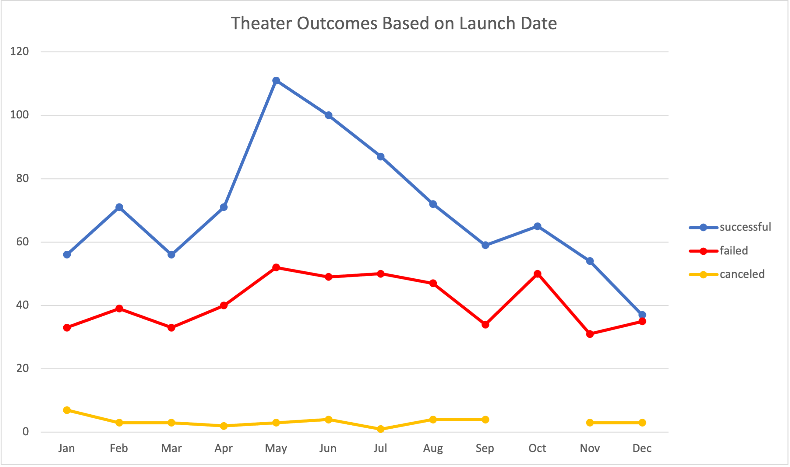

# Kickstarter-Analysis
Performing analysis on Kickstarter data to uncover trends.

## Overview of Project
The following analysis is conducted to determine the best outcomes around the year to launch a crowdfunding campaign for a theater play. We will examine a data file named Kickstarter to filter, apply different formulas and conditionals, and pivot tables to get the most out of the information provided on this file. Finally, pivot tables will help to back our recommendations based on data relevant to Louise project.  

### Purpose
This analysis report has been created with the purpose of helping Louise, a promising playwright who desires to start a crowdfunding campaign to help fund her play “Fever”, for which she has designated a budget of $10,000.00. Our objective is to provide a greater understanding of how other successful campaigns performed in relation to their launch date and funding goals. This information will allow Louise to make better decisions based on data and set her first play for success.  

## Analysis and Challenges
To help Louise make informed decisions we analyzed a crowdfunding  dataset containing project campaign information from 2014 to 2017 from 19 different countries, in which we paid special attention to the teather category, specifically “Plays”. This dataset contained three columns with relevant information needed to be further analyzed. The Goal column revealed how much money a campaign required to be successful. On the Pledge column we found out how much money the campaign actually made. Finally, the Outcomes column filtered out each of the campaigns by successful, canceled, and failed. To help Louise understand and visualize these findings we created  two tables to showcast the results. We used pivot tables and pivot charts to filter the dataset on “Theater Outcome by Launch Date” and by “Outcomes Based on Goals”.  

### Analysis of Outcomes Based on Launch Date
 

### Analysis of Outcomes Based on Goals

### Challenges and Difficulties Encountered
The following questions enclose the different challenges encountered while analyzing this dataset and the responses include the conclusions and recommendations provided to Louise expecting her crowdfunding campaign to succeed.  

## Results

- What are two conclusions you can draw about the Outcomes based on Launch Date?
*First Conclusion. Early summer is the best time to start crowdfunding a campaign based on the results obtained on our pivot table. The months of May, June and July proved to be a good time for theater productions with a total of 298 successful campaigns, 151 failed campaigns, and 8 canceled campaigns. We highly recommend Louise to consider this time of the year to start her crowdfunding campaign, being May the most successful time of the year to do so. 
*Second Conclusion. The worst time of the year to launch a campaign would be the month of December. Based on our data this month has the lowest number of productions launched in a year, 75 in total. Almost 51% of the total productions of the month had a canceled and failed outcome. We discourage Louise from starting a crowdfunding campaign for her play in December. 

- What can you conclude about the Outcomes based on Goals?
Since Louise has designated a budget of $10,000 to produce her play, our second pivot table allowed us to visualize how other plays within this goal range have performed in the past. We conclude that 46% of the total campaigns have been failed, while 54% of them have been successful. From our table we can appreciate how other campaigns with a lower budget have been more successful. On the other hand, we realized that campaigns with a much higher budget than Louise’s play have failed to accomplish their goal. 

- What are some limitations of this dataset?
The dataset could have information about the cost of the production so we can make comparisons with the pledge and goal amounts  and the risk, measured in percentage that a project could potentially face. 

- What are some other possible tables and/or graphs that we could create?
We can create another table where we analyze the pledge column data, which allows us to see how much money a play actually made, knowing that Louise could choose a play that has been successful in the past.  
